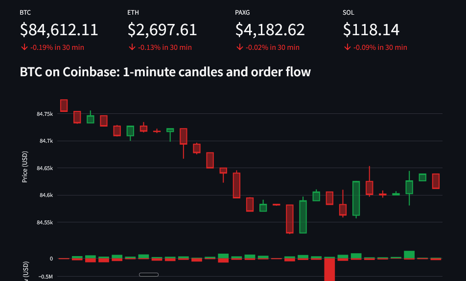
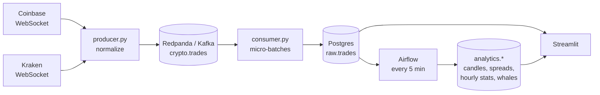

<div align="center">

# Crypto Pulse

**Hello, here you can watch every Bitcoin, Ethereum, Solana and gold-token trade on Coinbase and Kraken, live.**
**Spot the price gap between exchanges and catch whale trades the second they happen.**

One command. No API keys. Runs on your laptop.

[](https://github.com/med-med23/crypto-pulse/actions/workflows/ci.yml)




</div>

## What you get

- **Live candles and order flow.** 1-minute candlesticks built from raw trades, with taker buy vs sell pressure underneath.
- **Cross-exchange price gap.** The same coin often trades at slightly different prices on Coinbase and Kraken. See the gap in basis points, minute by minute, and which side is cheaper.
- **Whale alerts.** Every trade above $100k (you choose the threshold) shows up as it happens, and Airflow keeps a permanent log of them.
- **Gold, too.** PAXG is a token backed by physical gold, so you get a live gold price alongside crypto.
- **History that builds itself.** Airflow turns the raw stream into candles, hourly volatility, volume, buy pressure and spread stats every 5 minutes, with data quality checks.

## Quickstart

You need [Docker](https://docs.docker.com/get-docker/) and about 4 GB of free RAM.

```bash
git clone https://github.com/med-med23/crypto-pulse.git
cd crypto-pulse
docker compose up -d --build
```

Open **http://localhost:8501**. Trades start appearing within seconds.

| What | Where |
|---|---|
| Dashboard | http://localhost:8501 |
| Airflow | http://localhost:8080 (user `admin`, password from `make password`) |
| Kafka topic browser | http://localhost:8081 |
| Postgres | `localhost:5433`, user / password / db: `crypto` |

Want other coins? Copy `.env.example` to `.env` and edit `SYMBOLS` (any asset traded against USD on both exchanges).

## How it works



1. **Ingest.** One async producer holds WebSocket connections to both exchanges, reconnects with backoff, and converts each exchange's format into one trade schema. Prices stay exact (`Decimal`, never float).
2. **Buffer.** Trades go to a Kafka topic (Redpanda, which speaks the Kafka API with a fraction of the setup), keyed by exchange and symbol.
3. **Load.** The consumer writes micro-batches to Postgres and commits Kafka offsets only after the insert succeeds. Replays are harmless thanks to the `(exchange, symbol, trade_id)` primary key.
4. **Transform.** An Airflow DAG builds the analytics tables. Every task rebuilds a fixed lookback window, so retries never double-count.
5. **Serve.** Streamlit reads raw trades for the live view and Airflow's tables for history.

### The Airflow DAG

```
check_freshness ─┬─> build_candles_1m ─┬─> build_spread_1m ──────────┬─> run_data_quality_checks ─> prune_raw_trades
                 │                     └─> build_market_stats_hourly ─┤
                 └─> capture_whale_trades ────────────────────────────┘
```

Data quality checks run on every pass and are shown in the dashboard:

| Check | Catches |
|---|---|
| `candle_ohlc_consistent` | Candles where high/low don't bound open/close |
| `no_future_trades` | Clock or parsing bugs |
| `btc_spread_sane` | A BTC gap over 2% between major exchanges, which almost always means bad data |
| `candles_reconcile_with_raw` | Trades lost or double-counted between raw and modeled layers |

### A detail worth knowing

Coinbase reports the side of the **maker** order, while Kraken reports the **taker** (aggressor) side. The producer flips Coinbase's side so "buy" means the same thing on both exchanges. Without this, the buy/sell pressure charts would be inverted for half the data.

## Project structure

```
├── ingestion/
│   ├── producer.py        # WebSockets -> Kafka
│   ├── consumer.py        # Kafka -> Postgres
│   └── normalize.py       # exchange formats -> one schema (unit tested)
├── airflow/dags/          # transformations + data quality
├── dashboard/app.py       # Streamlit
├── sql/                   # schema, applied on first start
├── tests/
├── docker-compose.yml
└── Makefile               # make up / down / logs / psql / test
```

## Useful commands

```bash
make logs      # watch trades flow in
make psql      # query the data yourself
make test      # lint + unit tests
make reset     # wipe everything and start fresh
```

Some queries to try in `make psql`:

```sql
-- Biggest trades of the day
SELECT trade_ts, exchange, symbol, side, round(notional_usd) AS usd
FROM analytics.whale_trades ORDER BY notional_usd DESC LIMIT 10;

-- Which exchange is usually cheaper?
SELECT symbol, round(avg(spread_bps), 2) AS avg_bps
FROM analytics.spread_1m GROUP BY symbol;
```

## Roadmap and ideas

Contributions are welcome. Good first issues:

- [ ] Add another exchange (Bitstamp, OKX, Bybit all have public trade feeds)
- [ ] Telegram or Discord bot for whale alerts
- [ ] Replace the DAG's SQL with dbt models and tests
- [ ] Order book depth (level 2) and liquidity metrics
- [ ] Real-time windowed aggregations with a stream processor (Bytewax, Flink)
- [ ] One-click deploy to a cloud VM

## Disclaimer

This is an educational data engineering project, not a trading tool and not financial advice. A price gap between exchanges is not free money: fees, withdrawal times and slippage usually eat it. Market data comes from the public Coinbase Exchange and Kraken WebSocket APIs; check each exchange's terms before using it for anything beyond personal projects. Don't lose your money. I warned you guys. 

## License

MIT
